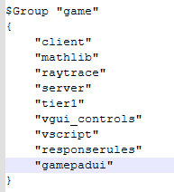
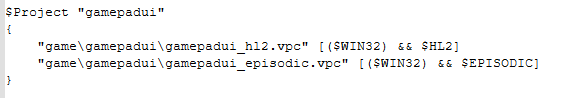
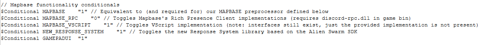
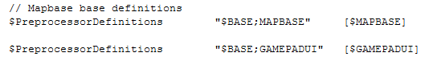

# Half-Life 2 GamepadUI (Mapbase Compatible)

## What is it?

Source code for the Steam Deck GamepadUI used by Half-Life 2, Episode 1, Episode 2 and Portal 1, partially modified to work with Mapbase.

It looks like this:

It's definitely not the cleanest thing in existence, especially as it was pretty rushed for the Steam Deck launch. However, you may be able to get some use out of it.

## What is here?

Provided is the full GamepadUI code, as well as the .vpc projects to build it. Pre-built binaries for stock Source SDK 2013 are included as well (Windows only right now). 

The UI can be enabled by adding `-gamepadui` to the startup parameters.

## Compiling

You will need to add definitions to gamepadui to the following `.vpc` & `.vgc` files within your source code's `vpc_scripts` folder:

### groups.vgc

In `$Group "game"` (and also `$Group "everything"` if your creating the everything `.sln`) add in `"gamepadui"` to the bottom. (If you're working with vanilla/unmodified Mapbase code, put it under `"responserules"`)

### projects.vgc

Under the `$Project "client"` definition, copy the following image:

### source_base.vpc

Inside the "Mapbase functionality conditionals" field, add in the following conditional underneath `$Conditional NEW_RESPONSE_SYSTEM`:

$Conditional GAMEPADUI	"1"

After that, underneath both `"$PreprocessorDefinitions		"$BASE;MAPBASE"		[$MAPBASE]"` within both Configurations, add the following:

$PreprocessorDefinitions 		"$BASE;GAMEPADUI"	[$GAMEPADUI]

After you've done all of that, create/rebuild your solution, if you now see the GamepadUI (HL2) and GamepadUI (Episodic) projects within your solution, you're on the right track.

Lastly, the function PostMessageToAllSiblingsOfType will need to be re-enabled in Panel.h, by changing its #if 0 to #if 1. Despite the code comment declaring otherwise, this function is safe to compile, and is necessary for GamepadUI to compile.

## SDK 2013 Notes

SDK 2013 by default does not have the modifications to the regular GameUI that were made that do things such as hide the main menu logo, or have the new loading screens.  
Provided in `game/bin` is a copy of GameUI for SDK 2013 with the modifications you can use, unfortunately the code for this cannot be provided.

 `IsSteamDeck()` currently returns a check for -gamepadui on the startup parameters. This can be modified as needed.
 
## Known Issues

- "SlideySlide" element can not be interacted with using the Mouse, only Movement Inputs.
- Joysticks and Trigger Axis inputs from Gamepads are not detected.

## Credits

Original code written by misyltoad and Madi. 
Chapter Art screenshots by Dan Smith.
